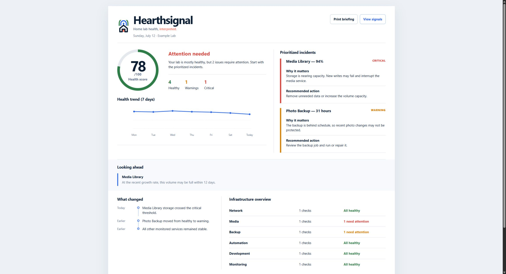

# Hearthsignal

A privacy-first daily operations briefing for people running a home lab.

> **Home lab health, interpreted.**

Hearthsignal tells you what is broken, what changed, why it matters, and what to do next—before you open six dashboards.

## See the briefing

[](reports/example-digest.html)

The daily briefing ranks what needs attention, explains the impact, recommends the next action, and confirms what remains healthy. [Open the complete HTML example](reports/example-digest.html).

Hearthsignal includes a ready-to-run example report and an opt-in live collector. Live checks are read-only, disabled until configured, and require an explicit `--live` acknowledgement.

## What the report explains

- A single health score and seven-day direction
- Incidents ranked by urgency
- Why each incident matters and what to do next
- What changed since the previous run
- Health by infrastructure category
- Which monitored systems are healthy

The premium HTML report is responsive, printable, dependency-free, and generated entirely on the user's machine.

## Example

```text
Hearthsignal — 2026-07-12
Overall status: ATTENTION

2 items need attention across 6 services.
Critical: Media Library disk usage is at 94%.
Warning: Photo Backup last completed 31 hours ago.
```

See the complete [example Markdown report](reports/example-digest.md) or [example HTML report](reports/example-digest.html).

## Quick start

Python 3.10 or newer is recommended. No third-party packages are required.

```powershell
python scripts/generate_digest.py --dry-run
```

The command reads `config.example.json` and the files in `sample-data/`, then writes:

- `reports/latest-digest.md`
- `reports/latest-digest.html`

To preview the generated HTML locally:

```powershell
Start-Process reports/latest-digest.html
```

The generator rejects remote URLs and paths outside this project. `--dry-run` explicitly selects bundled example-data mode.

Run the test suite with `python -m unittest discover -s tests -v`.

## Customize the example

1. Copy `config.example.json` to `config.local.json`.
2. Change the report title, owner label, thresholds, or fixture paths.
3. Edit copied example fixtures—not private infrastructure data.
4. Run:

```powershell
python scripts/generate_digest.py --config config.local.json --dry-run
```

## Try it on a small Docker home lab

The live collector covers Docker container health and resources, disk capacity, backup freshness, and HTTP availability.

```powershell
Copy-Item config.live.example.json config.live.json
notepad config.live.json
python scripts/collect_health.py --config config.live.json --live
```

Enable only the checks you want in `config.live.json`. The command creates `reports/live-digest.md` and `reports/live-digest.html`. No check is enabled in the example config, no credentials are requested, and the collector does not modify services.

Every problem includes its urgency, a plain-English explanation, and a recommended next step. Later runs also identify status changes since the previous run.

## Repository layout

```text
sample-data/   Bundled example inventory, results, and history
scripts/       Dependency-free local report generator
templates/     HTML template used by the generator
reports/       Static example and locally generated output
docs/          Setup, security, branding, and troubleshooting guides
```

## Supported today

Hearthsignal supports an offline example workflow plus opt-in Docker, disk, backup-file, and HTTP checks; configurable thresholds; change tracking; actionable recommendations; and Markdown/HTML output.

### Looking ahead

- Local 30-run measurement history and seven-day health-score trend
- Disk-capacity forecasts based on observed growth
- Docker CPU, memory, restart-count, image, and health signals
- Optional Discord delivery using an environment-provided webhook
- Guided initialization and readiness checks with the setup doctor

```powershell
python scripts/setup_hearthsignal.py --init
python scripts/collect_health.py --live --no-delivery
```

Planned integrations include Kubernetes and Proxmox APIs, Uptime Kuma/Gatus import, email and Slack delivery, automatic scheduling, and installation packaging. Privileged operations are outside Hearthsignal's security model.

## Documentation

- [Setup](docs/setup.md)
- [Security and sanitization](docs/security.md)
- [Brand system](docs/brand.md)
- [Troubleshooting](docs/troubleshooting.md)

## License

Hearthsignal is provided under the [MIT License](LICENSE).
